## Nesting Block Scopes

It's possible to make scopes inside of scopes.  This may sound intimidating and certainly can make code behavior more difficult to interpret, but the way JavaScript handles nested scope is not so difficult to understand.

From JavaScirpt's perspective, there is no difference between a nested block and an un-nested block.  Hopefully this example will help make that clear.


### Index:
* [The Code](#the-code)
* [The Sketches](#the-sketches)
* [More examples to study](#more-examples-to-study)

___

### The Code

This example illustrates how JS treats nested scopes and __let__ variables:  
* The variables are all arrays, at each point the arrays will indicate in which scope their variable is active.  
* The console.log's will indicate how JavaScript is dealing with scopes in the background.

```js
let block_0 = ['b0'];
console.log('preparing block 1');
{
  let block_1 = [];
  block_0.push('b1'), block_1.push('b1');
  console.log('preparing block 2');
  {
    let block_2 = [];
    block_0.push('b2'), block_1.push('b2'), block_2.push('b2');
    console.log('clearing block 2'), block_0.pop(), block_1.pop();
  };
  console.log('clearing block 1'), block_0.pop();
};
console.log('final state');
```

[PythonTutor link](https://goo.gl/LejEUJ)

[Parsons Practice](https://elewa-academy.github.io/parsons/examples-to-study/nesting-scopes.html)

___


### The Sketches

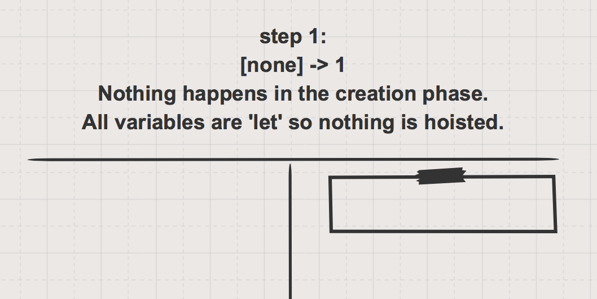
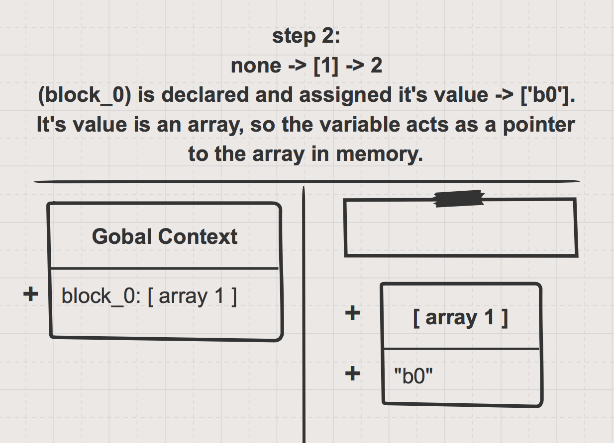
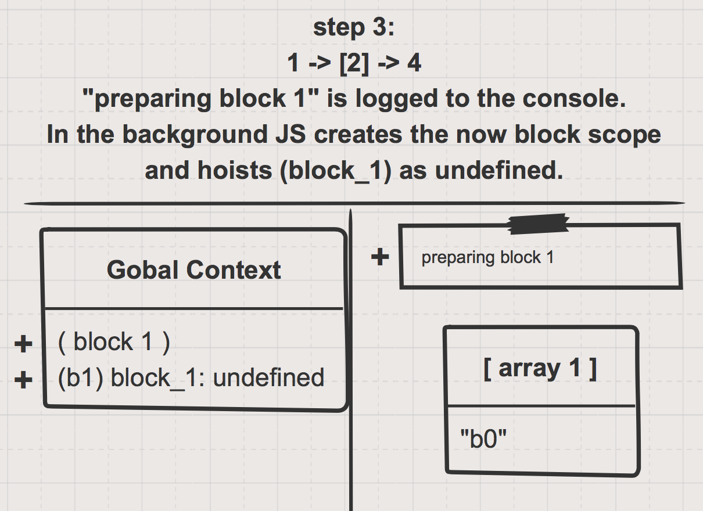
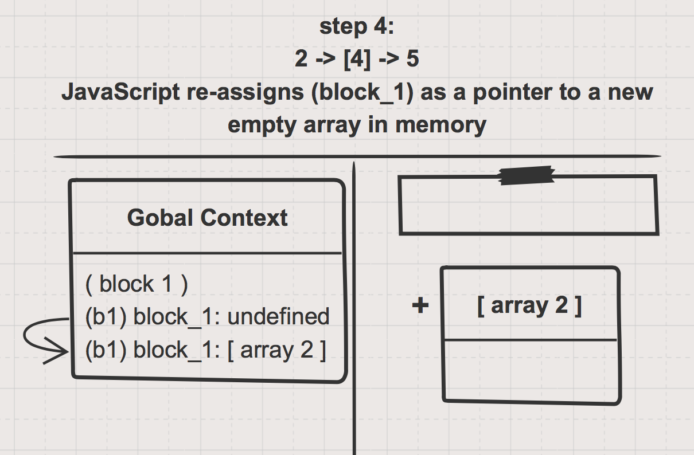
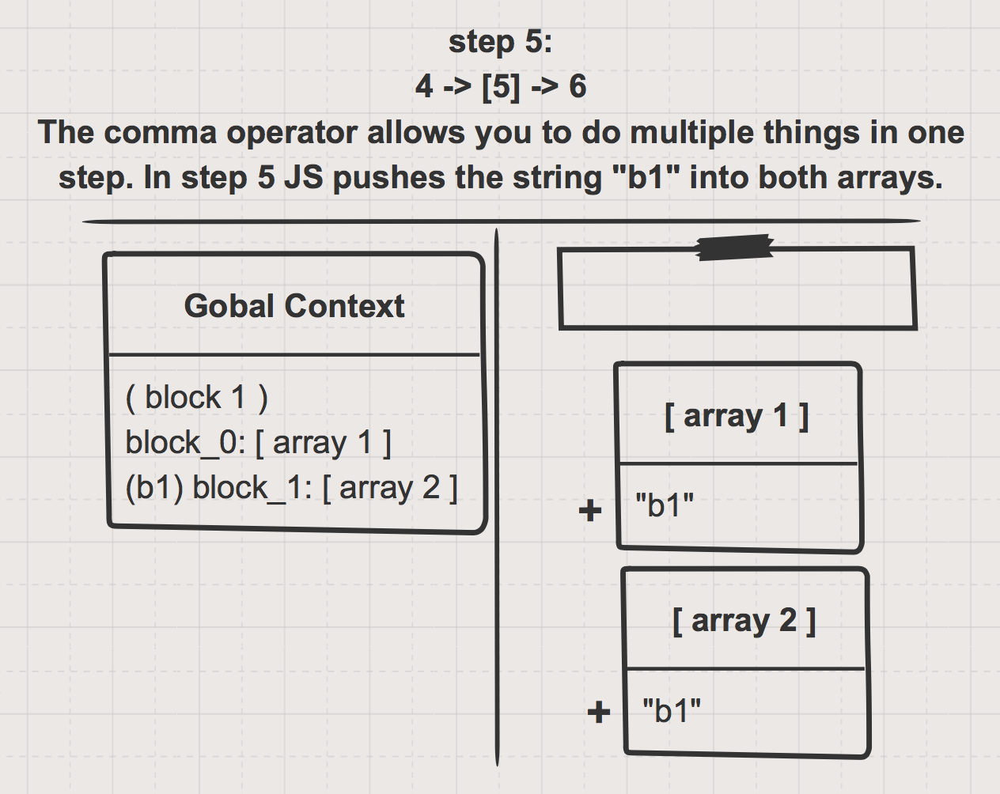
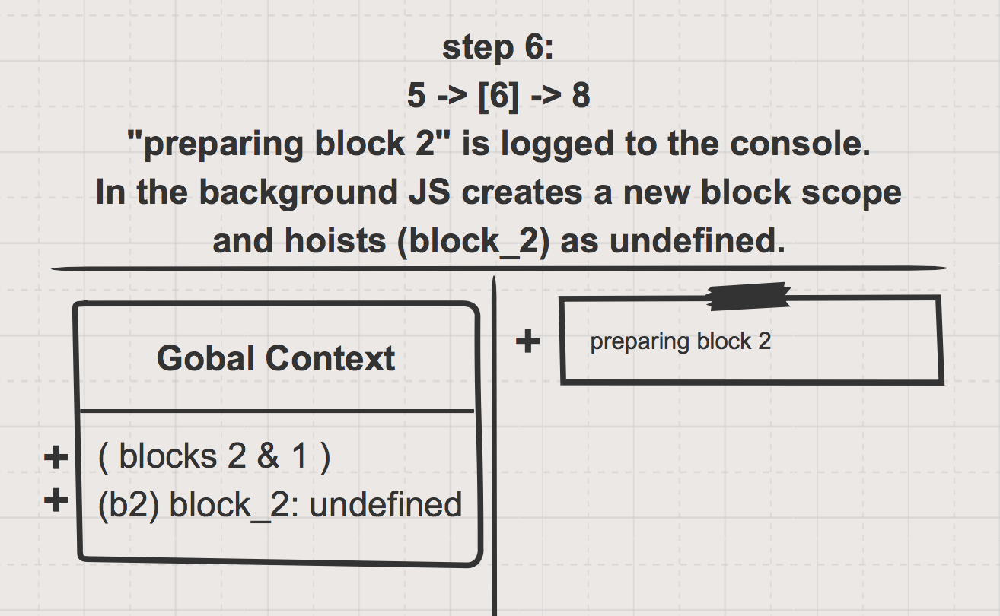
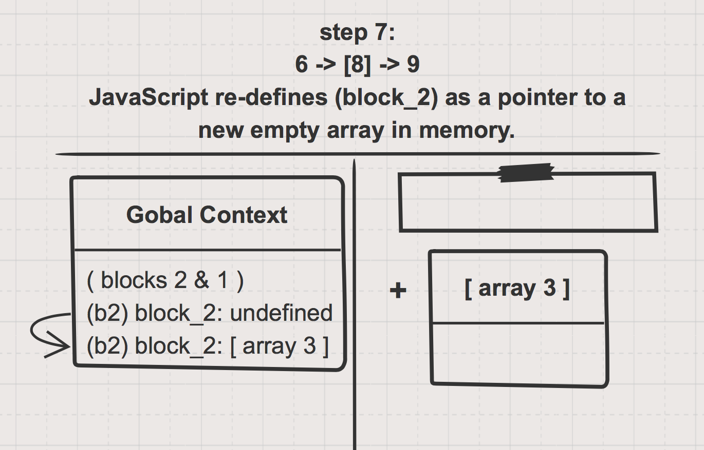
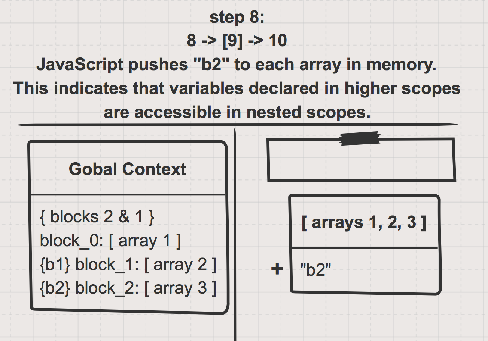
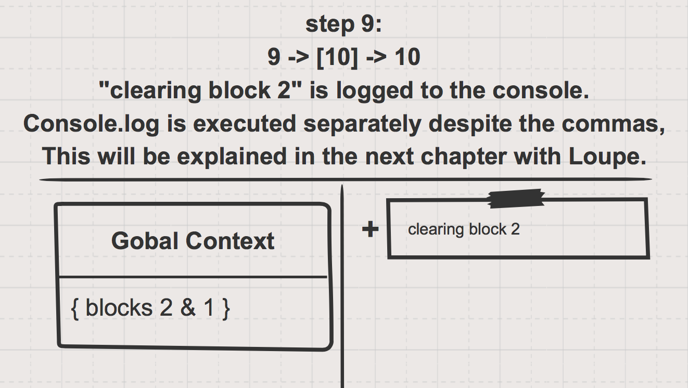
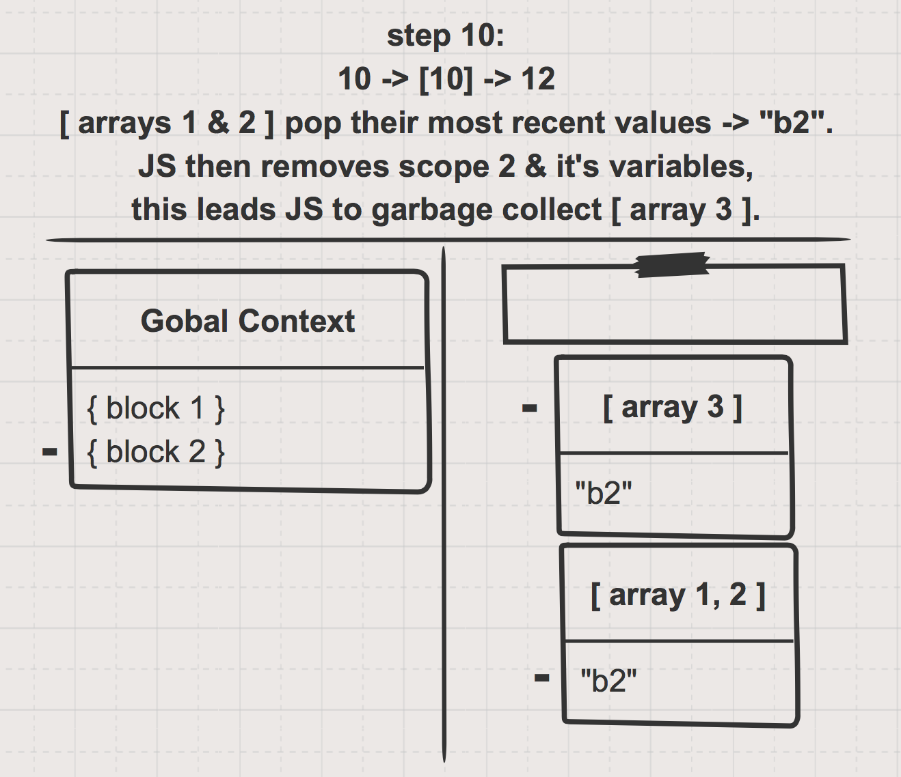
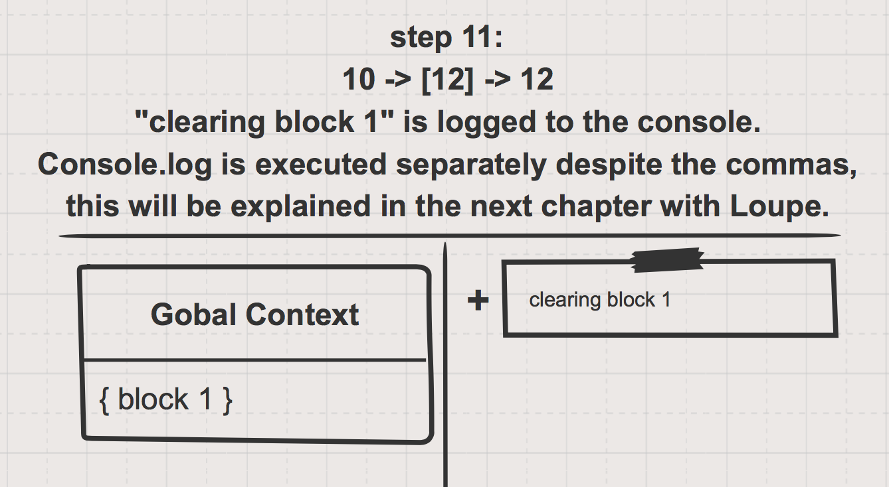
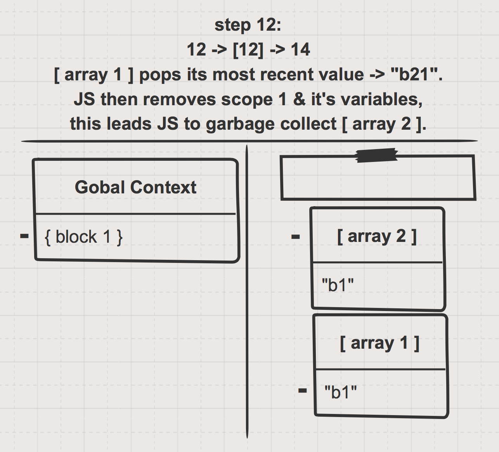
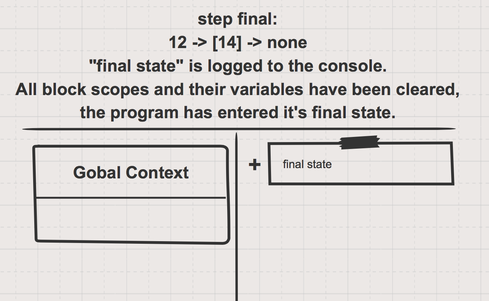

___

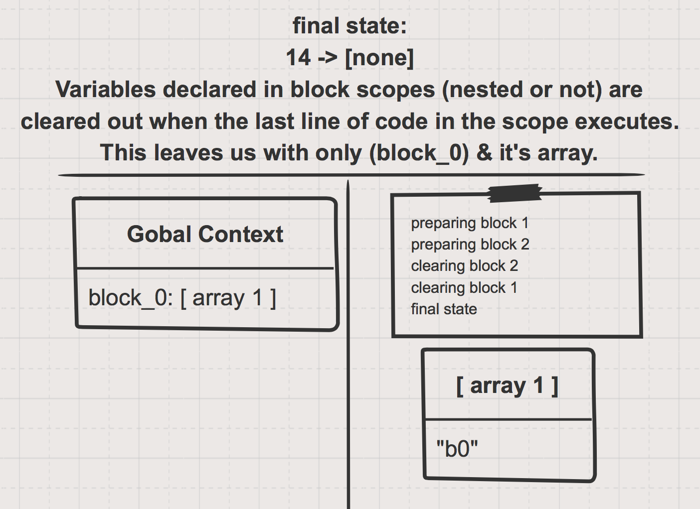

___

### More examples to study


Very long/thorough example. ([PythonTutor link](https://goo.gl/qC9ppR)):
```js
let global_let = 'global_let';
var global_var = 'global_var';
{
    let b_1_let = 'b_1_let';
    var b_1_var = 'b_1_var';
    {
        let b_2_let = 'b_2_let';
        var b_2_var = 'b_2_var';

        global_let;
        global_var;
        b_1_let;
        b_1_var;
        b_2_let;  
        b_2_var;
    };

    global_let;
    global_var;
    b_1_let;
    b_1_var;
    // b_2_let;  // -> ReferenceError: b_2_let is not defined
    b_2_var;
};

global_let;
global_var;
// b_1_let;  // -> ReferenceError: b_1_let is not defined
b_1_var;
// b_2_let;  // -> ReferenceError: b_2_let is not defined
b_2_var;
```

___
___
### <a href="http://elewa.education/blog" target="_blank"></a>

